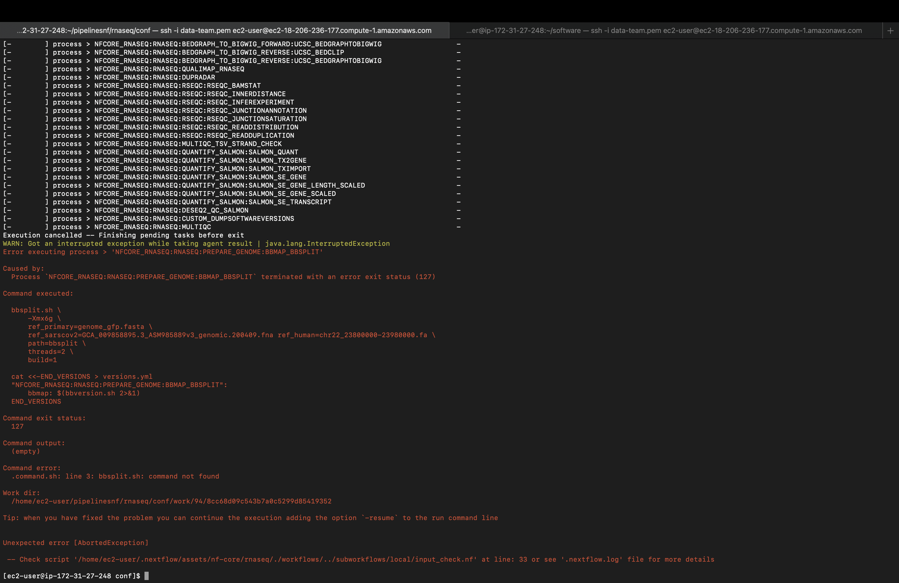

```{r setup, include=FALSE}
knitr::opts_chunk$set(echo = TRUE)
```

# RNASEQ analysis
https://github.com/nf-core/rnaseq

* Clone the repo:

```{bash clone, eval=FALSE}
git clone https://github.com/nf-core/rnaseq.git
```

* Run a test:

change YOURPROFILE for the name of .conf file you want to run:
(under conf folder)

```{bash test, eval=FALSE}
nextflow run nf-core/rnaseq -profile test --outdir test0
```

Error:

