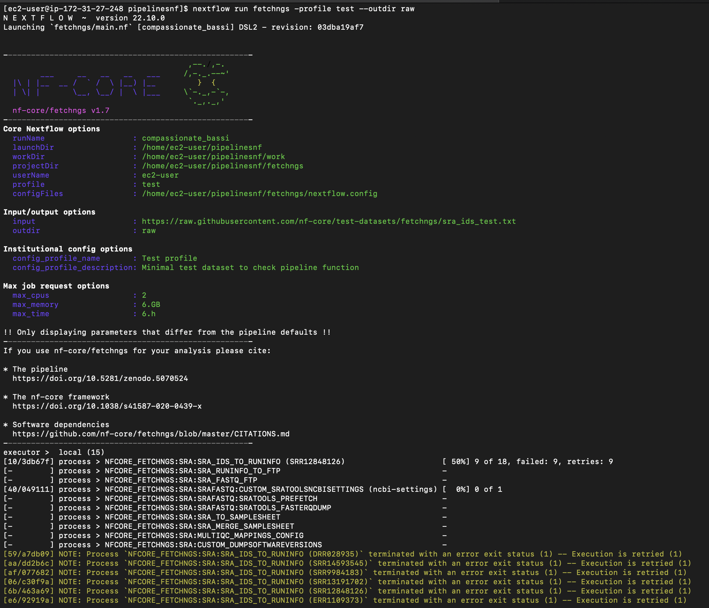
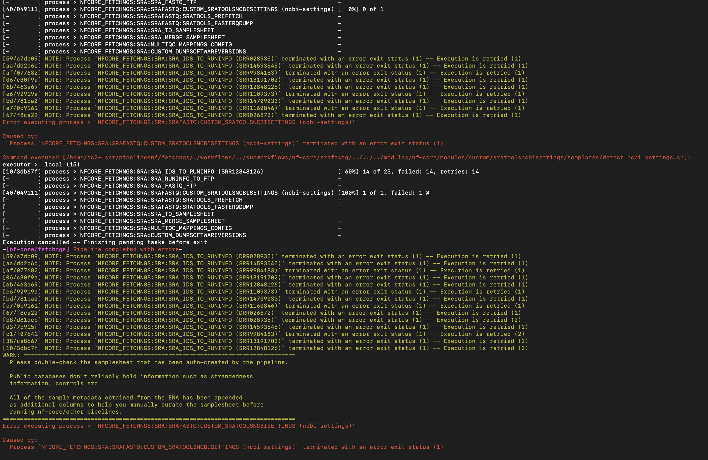

```{r setup, include=FALSE}
knitr::opts_chunk$set(echo = TRUE)
```

#  Fetch data from SRA

```{bash clone, eval=FALSE}
git clone https://github.com/nf-core/fetchngs.git
```


```{bash run, eval=FALSE}
nextflow run fetchngs -profile test --outdir raw
```

* Ok




* Error: 

